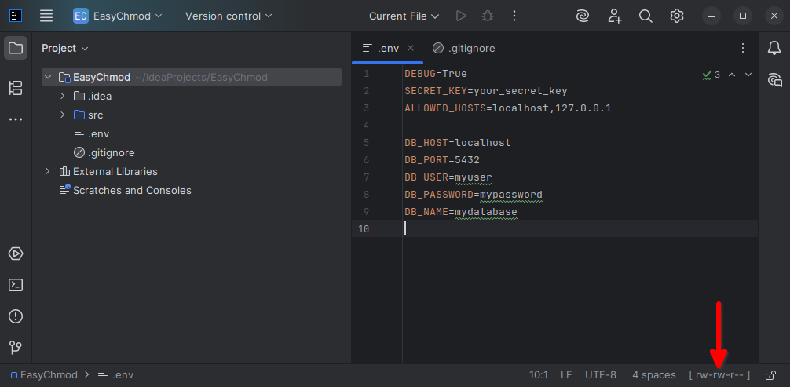
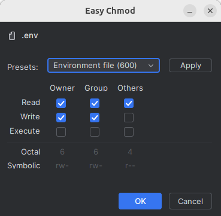
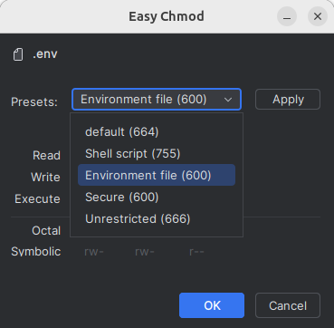
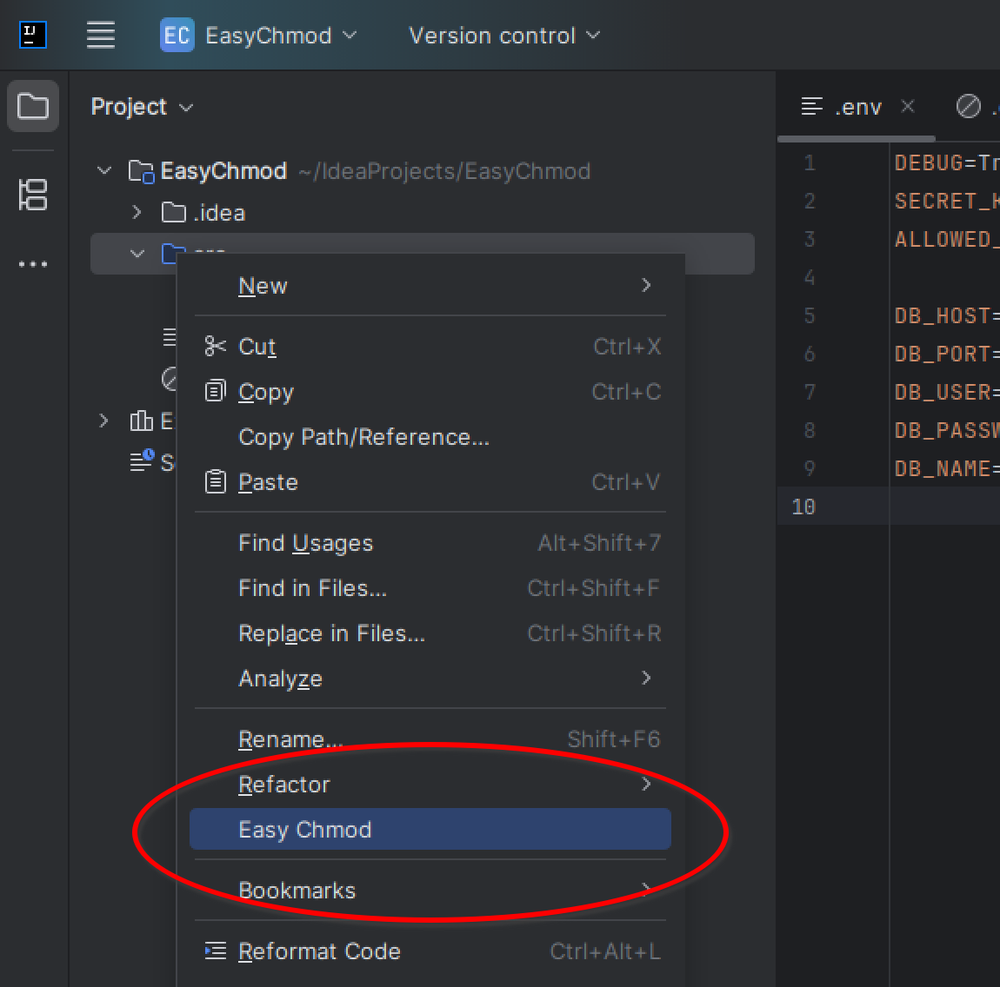
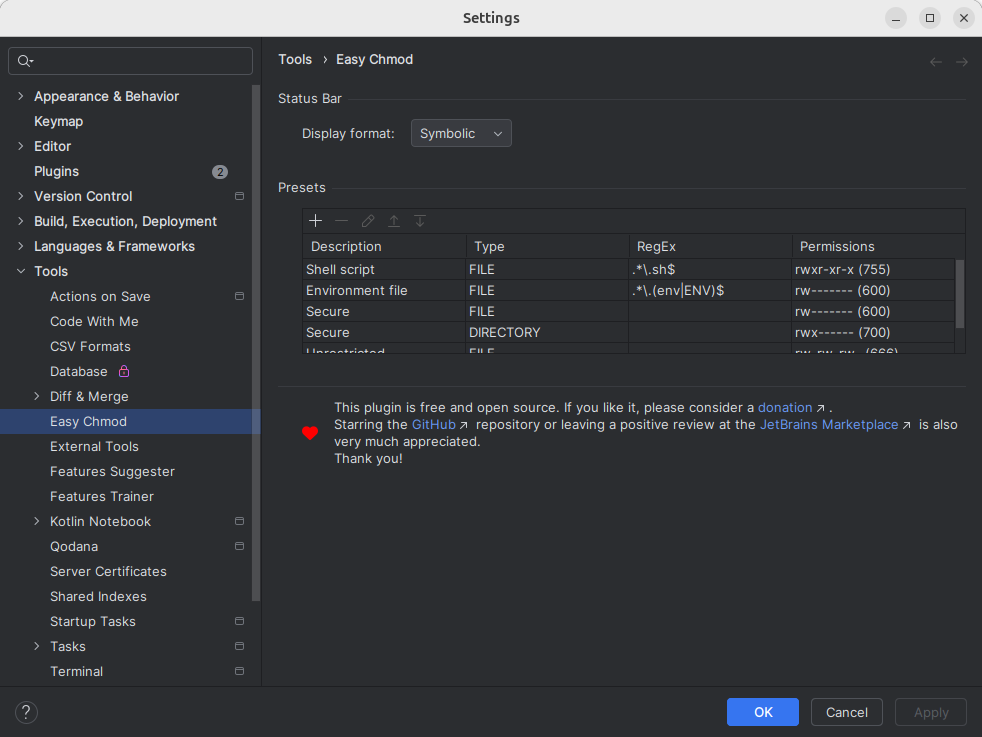

#   IntelliJ Easy Chmod

> Change file permissions from within your IDE.

## Table of Contents

* [Screenshots](#screenshots)
* [Notes](#notes)
* [Credits](#credits)
* [License](#license)
* [Donate](#donate) :heart:

## Screenshots

#### Statusbar Widget

The new statusbar widget shows the permissions of the currently edited file:

(Clicking on it will open the edit dialog.)

#### Edit Dialog 

Manually set all permissions; or apply an existing preset:

#### Context Menu Entry

A dedicated context menu entry is also available, which can also be used to alter permissions of folders:

#### Settings

The plugin's settings-dialog:

## Notes

* This plugin deliberately doesn't operate in bulk but only changes file permissions for one file/directory at a time. 

## Credits

* Plugin icon based on [file-csv](https://fontawesome.com/icons/file-csv?f=classic&s=solid) / [Font Awesome](https://fontawesome.com)

## License

Please read the [license](LICENSE) file.

## Donate

If you like this plugin, please consider a [donation](https://paypal.me/AchimSeufert). Thank you!
